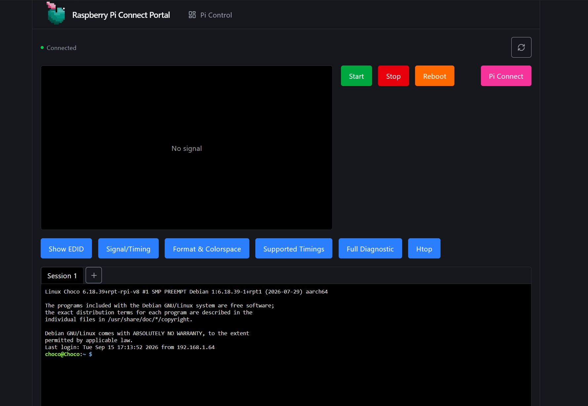
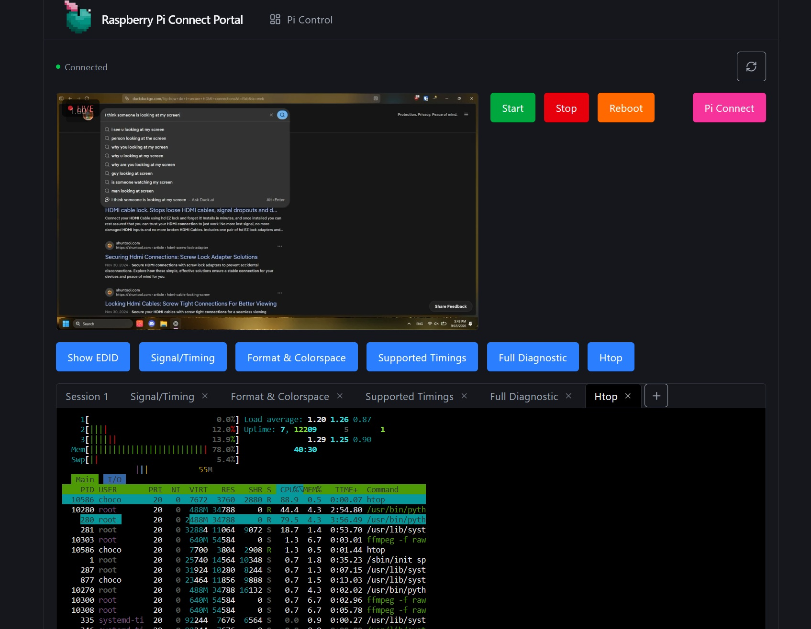
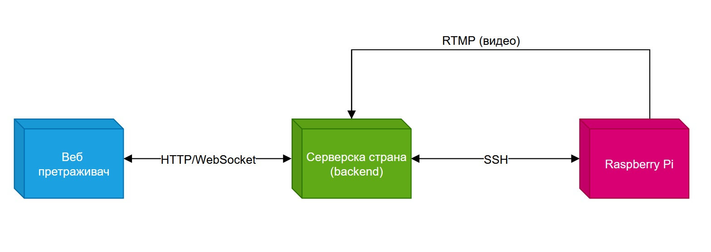

# Pi Control Portal

Prateći alat uz moj diplomski rad na temu snimanja HDMI komunikacije i manipulacije EDID-om. Dok glavni sistem (`set-edid.service` i `hdmi-mirror.service`) radi direktno na Raspberry Pi uređaju i ne zahteva nikakvu interakciju, ovaj web dashboard služi kao praktičan alat za daljinsko praćenje i upravljanje tim sistemom preko LAN mreže — uživo prikaz HDMI signala, pristup konzoli preko SSH-a, i pokretanje/zaustavljanje servisa jednim klikom, bez potrebe za fizičkim pristupom uređaju ili ručnim SSH povezivanjem iz terminala.




## Kako je napravljeno

Dva dela, u jednom repozitorijumu:

* `frontend/` — sama stranica: video plejer, konzola, dugmad. Vite + React + TypeScript.
* `backend/` — manji Node server sa kojim frontend komunicira. Postoji zato što browser sam po sebi ne može da otvori sirovu SSH ili RTMP konekciju — nešto mora da stoji između.



## Tehnologije na backend-u

| Namena | Biblioteka | Šta radi |
| --- | --- | --- |
| HTTP API | Express | Servira `/api/health` i `/api/commands` |
| SSH konzola | `ssh2` | Otvara jednu trajnu SSH sesiju ka Pi-ju i održava je aktivnom, automatski se ponovo povezuje ako veza padne |
| Uživo konzola | `ws` (WebSocket) | Prosleđuje izlaz SSH konzole u browser i vraća otkucani unos/komande nazad |
| Prijem i prikaz videa | `node-media-server` | Prima RTMP stream sa Pi-ja i ponovo ga servira kao HTTP-FLV da bi browser mogao da ga pusti |

## Portovi

| Port | Za šta se koristi | Podešava se preko |
| --- | --- | --- |
| 5173 | Frontend dev server (sama stranica) | `FRONTEND_URL` u `.env` |
| 3000 | Backend HTTP API + WebSocket | `BACKEND_PORT` u `.env` |
| 1935 | RTMP prijem — ovo je adresa na koju Pi šalje video | `RTMP_PORT` u `.env` |
| 8000 | HTTP-FLV plejbek — odavde video plejer u browseru povlači stream | `MEDIA_HTTP_PORT` u `.env` |

## Podešavanje

Kopirati env fajl i popuniti podatke o svom Pi uređaju:

```bash
cp .env.example .env

```

Minimum je potrebno podesiti `PI_HOST` (LAN IP adresa Pi-ja), `PI_USERNAME` i `PI_PASSWORD`.

Instalirati sve (jedna komanda instalira root alate, backend i frontend):

```bash
npm install

```

Usmeriti video stream sa Pi-ja ka ovom backend-u. Gde god Pi-jev skript podešava RTMP publish URL, mora da se poklopi sa `STREAM_APP`/`STREAM_KEY` iz `.env`:

`rtmp://<LAN-IP-ove-mašine>:1935/live/hdmi`

Koristiti LAN IP mašine na kojoj radi backend — ne localhost — pošto je Pi zaseban uređaj.

Pokrenuti oba servera zajedno:

```bash
npm run dev

```

Zatim otvoriti `http://localhost:5173` (ili ono na šta pokazuje `FRONTEND_URL`).

## Šta stranica radi

* **Video panel** — prikazuje "LIVE" kada Pi aktivno strimuje, "No signal" kada ne strimuje.
* **Konzola** — prikaz uživo SSH sesije na Pi-ju, sa poljem za unos na dnu za kucanje sopstvenih komandi. Ako neka komanda zahteva sudo, prompt za lozinku se pojavi tu, i unosiš je ručno — ništa se ne čuva niti automatski popunjava, osim same inicijalne SSH prijave.
* **Dugmad** (definisana u `backend/src/commands.ts` — taj fajl se menja da bi se dugmad promenila):
* **Start** — uključuje i pokreće `set-edid` i `hdmi-mirror` systemd servise
* **Stop** — zaustavlja oba servisa
* **Reboot** — restartuje Pi


* **Reconnect dugme** (gore desno) — forsira trenutni pokušaj ponovnog SSH povezivanja, umesto čekanja na automatski retry na svakih 5 sekundi.
* **Pi Connect dugme** — otvara Raspberry Pi-jev sopstveni portal za udaljeni pristup (`connect.raspberrypi.com`) u novom tabu, kao rezervna opcija ako ovaj dashboard nije dostupan.

## Komande na nivou root-a

Pokreni ove komande iz korena repozitorijuma (`Web portal/`):

| Komanda | Šta radi |
| --- | --- |
| `npm install` | Instalira zavisnosti za root, backend i frontend |
| `npm run dev` | Pokreće backend + frontend zajedno, sa označenim izlazom |
| `npm run build` | Builduje prvo backend pa frontend za produkciju |
| `npm run build:backend` | Builduje samo backend |
| `npm run build:frontend` | Builduje samo frontend |
| `npm run format` | Formatira ceo repozitorijum preko Prettier-a |
| `npm run format:check` | Proverava formatiranje bez menjanja fajlova |

## Rešavanje problema

* **Konzola piše "Disconnected" i ne povezuje se** — proveriti izlaz u samom terminalu backend-a; loguje `[ssh] connecting to ...` i tačnu grešku (pogrešan IP, connection refused, odbijena autentifikacija, itd.). Probati i reconnect dugme nakon što se osnovni problem reši.
* **Video nikad ne postane live** — stream key u Pi-jevom `STREAM_URL` mora tačno da se poklopi sa `STREAM_APP`/`STREAM_KEY` u `.env` (podrazumevano `live/hdmi`). Neslaganje ne baca grešku — status samo nikad ne pređe u "live".
* **CORS / connection refused iz browsera** — `FRONTEND_URL` u `.env` mora da se poklopi sa URL-om sa kog se stranica stvarno servira. Restartovati backend nakon izmene `.env`.

## Konfiguracija

Sva konfiguracija se nalazi u jednom zajedničkom `.env` fajlu u korenu repozitorijuma. Pogledati `.env.example` za kompletnu listu promenljivih sa komentarima.

## Frontend šablon 

Frontend šablon sam ja napravila i možete ga videti na https://github.com/Emi7i/React-TS-Structure-Template